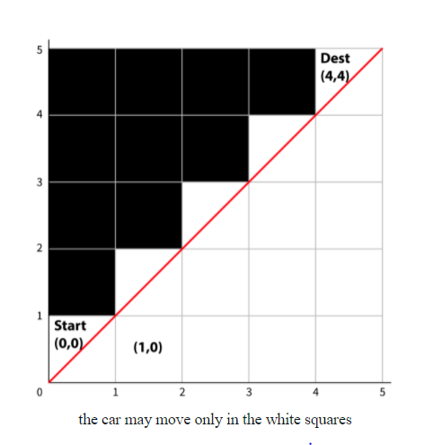

# leetcode

My solutions to online coding questions from leetcode, hackerRank, etc.

Question: Number of Paths \
You’re testing a new driverless car that is located at the Southwest (bottom-left) corner of an n×n grid. The car is supposed to get to the opposite, Northeast (top-right), corner of the grid. Given n, the size of the grid’s axes, write a function numOfPathsToDest that returns the number of the possible paths the driverless car can take.  
  

For convenience, let’s represent every square in the grid as a pair (i,j). The first coordinate in the pair denotes the east-to-west axis, and the second coordinate denotes the south-to-north axis. The initial state of the car is (0,0), and the destination is (n-1,n-1).

The car must abide by the following two rules: it cannot cross the diagonal border. In other words, in every step the position (i,j) needs to maintain i >= j. See the illustration above for n = 5. In every step, it may go one square North (up), or one square East (right), but not both. E.g. if the car is at (3,1), it may go to (3,2) or (4,1).

Explain the correctness of your function, and analyze its time and space complexities.

Test Input and Output:  
num_of_paths_to_dest(1) = 1  
num_of_paths_to_dest(2) = 1  
num_of_paths_to_dest(3) = 2  
num_of_paths_to_dest(4) = 5  
num_of_paths_to_dest(6) = 42  
num_of_paths_to_dest(17) = 35357670  

Question: 189. Rotate Array
Given an array, rotate the array to the right by k steps, where k is non-negative.   

Example 1:  

Input: nums = [1,2,3,4,5,6,7], k = 3  
Output: [5,6,7,1,2,3,4]  
Explanation:  
rotate 1 steps to the right: [7,1,2,3,4,5,6]  
rotate 2 steps to the right: [6,7,1,2,3,4,5]  
rotate 3 steps to the right: [5,6,7,1,2,3,4]  
Example 2:  

Input: nums = [-1,-100,3,99], k = 2  
Output: [3,99,-1,-100]  
Explanation:   
rotate 1 steps to the right: [99,-1,-100,3]  
rotate 2 steps to the right: [3,99,-1,-100]  
 
Constraints:  

1 <= nums.length <= 105  
-231 <= nums[i] <= 231 - 1  
0 <= k <= 105  
 
Follow up:  
Try to come up with as many solutions as you can. There are at least three different ways to solve this problem.  
Could you do it in-place with O(1) extra space?  
